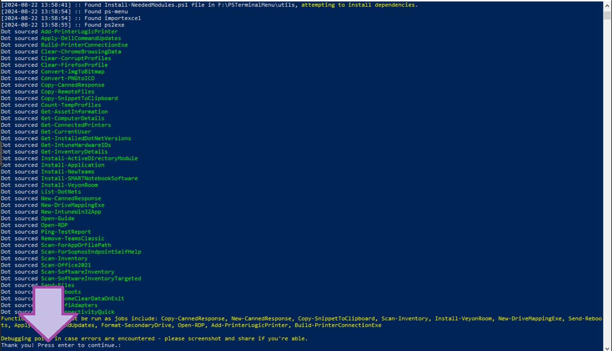

# PS Terminal Menu
  

### NOTE: I will be getting _replacing_ this repository soon with a more streamlined version, hopefully in the form of a module that centers around the scans and report-generating functions but still allows addition of functions.
### The function structure/template will also be replaced with a simpler one that does not use begin/process/end - it adds unnecessary complexity. 11-19-24

To clarify - the begin/process/end structure was used so functions would accept pipeline input of TargetComputer parameter, and non-pipeline. Functions were structured this way so they could be pasted into the terminal and used without the menu/etc.

I'm hoping the module will let me shorten the functions a bit, without sacrificing functionality. The copy/paste method may not work with the module since functions will rely on get-targgets.ps1/etc.

### I expect this repo to be up as is for another month or two.

<h2>Introduction</h2>

Working as an IT Support Specialist in 2022, I quickly became captivated with Powershell and it's ability to increase my efficiency.

I was amazed at the variety of Powershell modules that make it possible to interact with nearly every aspect of a Windows computer/network environment.

I already had a bit of a background in Java, Python, and object-oriented programming. While performing my duties, I began to take note of tasks or issues that had programmatic resolutions. I started to create scripts to perform tasks and implement resolutions, and I eventually reached a point where I realized that I needed to have all of these useful scripts in a single location, able to be executed on-demand at any given moment throughout my work day.

<h3 >It was from this realization that the PSTerminalMenu tool was born - it's evolved into a collection of useful functions centered around the menu.ps1 script, which allows for their interactive selection and execution.</h3>

<b>This is an ongoing project, I appreciate any feedback or contributions!</b>

<h2>Table of Contents</h2>

- [Usage](#usage)
- [Examples](#examples)
- [Editing the Menu through config.json](#editingmenu)
- [SupportFiles](#supportfiles)
- [Functions](#functions)
- [Modules](#modules)
- [Resources](#resources)
- [License](#license)

<br>
<h2 id="usage">Usage</h2>

Download the repository .zip folder or download latest release and execute the menu.ps1 script.

```powershell
## Execute the PSTerminalMenu main script
Powershell.exe -ExecutionPolicy Bypass ./Menu.ps1
```

<h3 >Module and Function Import</h3>

<p><b>Menu.ps1 will attempt to import all necessary modules and dot source functions from the function directory.</b></p>

<table>
<tr>
<td>
<p>The script will either attempt to install/import modules from the Internet, or use local copies of the modules found in the SupportFiles directory.</p>

<p>In some niche cases, user may receive prompts or modules may have to be installed manually.</p>
</td>
<td>
<p></p>
</td>
</tr>
</table>
<p><b>After successful import of modules and functions, the user must press ENTER to proceed to category menu.</b></p>

<br>
<h3 >Interactive Terminal Menus</h3>

<p>After executing the menu.ps1 script and modules/functions are imported, the script will <b>display the first terminal menu:</b> Category Selection.</p>

<p>Each category contains a number of functions, <b>configured through <i>SupportFiles/config.json</i></b></p>
<br>
<h3 >Search Functions</h3>

<h3 >If you're not sure which category holds a function, you can <b>use 'Search'</b>, located in the first menu.</h3>
<p>Search will return any functions containing the keyword submitted and present them as a menu.</p>

<br>
<h3 >Return to Previous Menu</h3>

<h3>After searching or choosing a category, you can return to the category selection menu by choosing this option.</h3>

<br>
<h2 id="examples">Examples</h2>

<details>
<summary><b>Get basic computer details from single PC and output to file.</b></summary>
<br>
<code>
./menu.ps1 > Scans > Get-ComputerDetails
</code>
<br>
<table>
<tr><td><b>TargetComputer</b></td><td>t-client-01</td></tr>
<tr><td><b>OutputFile</b></td><td>client-01-details</td></tr>
</table>
</details>
<br>
<details>
<summary><b>Search for any functions containing the word 'Intune'</b></summary>
<br>
<code>
./menu.ps1 > Search > 'Intune'
</code>
<br>
</details>
<br>
<details>
<summary><b>Get Intune hardware IDs from all devices with hostnames starting with 's-pc-', include DeviceGroupTag in HWID.</b></summary>
<br>
<code>
./menu.ps1 > Search > 'Intune' > Get-IntuneHardwareIDs
</code>
<br>
<table>
    <tr>
        <td><b>TargetComputer</b></td><td>s-pc-</td>
    </tr>
    <tr>
        <td><b>DeviceGroupTag</b></td><td>EmployeePCs</td>
    </tr>
    <tr>
        <td><b>OutputFile</b></td><td>s-pc-hwids</td>
    </tr>
</table>
</details>

<br>
<h2 id="editingmenu">Editing the Menu through config.json</h2>

<table style="margin: 0 150px;">
<tr><td style=""><h2 >To add a category to the menu..</h2><p>Write the name of the category into `config.json`, similar to what's shown in the image to the right.</p></td>
<td style="min-width:400px;"></td>
</tr>
</table>

<br>
<hr>

<table style="margin: 0 150px;">
<tr><td style=""><h2 >To add an option to the menu..</h2><p>Write the name of the file (without extension) into `config.json`, similar to what's shown in the image to the right.</p>
<p>If you add the filename into the "scans" section of the config file, it will appear after choosing the 'scans' category in the terminal menu.</p></td>
<td style="min-width:400px;">
</td>
</tr>
</table>

<br>
<hr>

<table style="margin: 0 150px;">
<tr><td style=""><h2 >To add a function to the menu..</h2><p>Create a new .ps1 file in the functions directory. The function name should match the file name.</p>
<p>The function should have a multi-line comment at the top, containing the function description and parameter descriptions so that they'll display in the terminal when the function is chosen, <b>typical format for the comment is shown in the image to the right</b>.</p></td>
<td style="min-width:600px;">

</td>
</tr>
</table>

<h3 ><b>SupportFiles/function_template.ps1</b> can be helpful as a starting point for developing new functions.</h3>

<br>
<h2 id="supportfiles">SupportFiles Explanation</h2>

This is a listing of the files in the SupportFiles directory with a brief description of their purpose.

<table>
  <tr>
    <td><strong>config.json</strong></td>
    <td>Contains the menu categories and functions.</td>
  </tr>
  <tr>
    <td><strong>drivemap.ico</strong></td>
    <td>Used in the New-DriveMappingExe function to create generic icon for shortcut.</td>
  </tr>
  <tr>
    <td><strong>function_template.ps1</strong></td>
    <td>Template for creating new functions. Contains the begin and end blocks - most important part to add to the function is the scriptblock that is executed on each target computer.</td>
  </tr>
  <tr>
    <td><strong>Get-WindowsAutoPilotInfo.ps1</strong></td>
    <td>Used in Get-IntuneHardwareIDs function as an alternative to Importing the Get-WindowsAutoPilotInfo script from the Internet.</td>
  </tr>
  <tr>
    <td><strong>IntuneWinAppUtil.exe</strong></td>
    <td>Used in the New-IntuneWinApp function to create .intunewin package from a PSADT deployment folder.</td>
  </tr>
  <tr>
    <td><strong>inventory_database_api_response.json</strong></td>
    <td>A sample of a response from upcitemdb.com's UPC code lookup API, gives information about specified product.</td>
  </tr>
  <tr>
    <td><strong>it-logo.png</strong></td>
    <td>Used in New-BrandedHTMLReport function (currently in testing dir) to add generic IT Dept. logo.</td>
  </tr>
  <tr>
    <td><strong>negativebeep.wav</strong></td>
    <td>Used in the Scan-Inventory function to play audible negative sounding beep when something bad happens.</td>
  </tr>
  <tr>
    <td><strong>positivebeep.wav</strong></td>
    <td>Used in the Scan-Inventory function to play audible positive sounding beep when something good happens.</td>
  </tr>
  <tr>
    <td><strong>ps1avatar.ico</strong></td>
    <td>Generic/cool-looking Powershell avatar icon that can be used with compiled executables/etc. if nothing more appropriate available.</td>
  </tr>
  <tr>
    <td><strong>teamsbootstrapper.exe</strong></td>
    <td>Used in the New-TeamsInstaller function to install Teams on a remote computer.</td>
  </tr>
  <tr>
    <td><strong>w3.css</strong></td>
    <td>Used in the New-BrandedHTMLReport function to add styling to the HTML report.</td>
  </tr>
</table>

<br>
<h2 id="functions">Stand-alone Functions</h2>

Each function in the functions directory of PSTerminalMenu should also work as a 'standalone' function. This means that you should be able to copy/paste the function into a terminal, and execute it with appropriate parameters.

For example:

<b>Get-ComputerDetails.ps1</b>

```powershell
## Gather computer details from computers w/hostnames starting with s-a231- or s-a230-, output to GridView
Get-ComputerDetails -TargetComputer 's-a231-,s-a230-' -OutputFile n

## Gather two computers' details, output to computer-info.csv/xlsx file:
's-a231-01,s-a231-02' | Get-ComputerDetails -OutputFile computer-info
```

<p>Note that there are a couple functions that interact with BIOS/firmware of Dell computers - these functions likely need to have the Dell BIOS password inserted to function correctly. At the moment, functions should have a blank variable called $BIOS_PWD that can be filled in until a more secure method is implemented.</p>

<br>
<h2 id="modules">Modules</h2>

PSTerminalMenu uses the following modules for core operation:

<table>
  <tr>
    <td><strong>ImportExcel</strong></td>
    <td>for creating XLSX reports from results or data gathered. PSTerminalMenu will also create CSV reports, but XLSX reports are easier to deal with in some cases.</td>
  </tr>
  <tr>
    <td><strong>PSMenu</strong></td>
    <td>for displaying the interactive terminal menu for category and function selection. Some functions actually use this module as well (for ex: Install-Application).</td>
  </tr>
  <tr>
    <td><strong>PS2EXE</strong></td>
    <td>Some functions will create scripts dynamically and compile them into executables using this module.</td>
  </tr>
</table>

<h2 id="resources">Resources</h2>

<table>
  <tr>
    <td><strong>Get-WindowsAutoPilotInfo.ps1</strong></td>
    <td><a href="https://github.com/Dattics/GetWindowsAutopilot">https://github.com/Dattics/GetWindowsAutopilot</a></td>
  </tr>
  <tr>
    <td><strong>IntuneWinAppUtil.exe</strong></td>
    <td><a href="https://github.com/microsoft/Microsoft-Win32-Content-Prep-Tool">https://github.com/microsoft/Microsoft-Win32-Content-Prep-Tool</a></td>
  </tr>
  <tr>
    <td><strong>PS-MENU</strong></td>
    <td><a href="https://github.com/chrisseroka/ps-menu">https://github.com/chrisseroka/ps-menu</a></td>
  </tr>
  <tr>
    <td><strong>IMPORTEXCEL</strong></td>
    <td><a href="https://github.com/dfinke/ImportExcel">https://github.com/dfinke/ImportExcel</a></td>
  </tr>
  <tr>
    <td><strong>PSADT</strong></td>
    <td><a href="https://psappdeploytoolkit.com/">https://psappdeploytoolkit.com/</a></td>
  </tr>
</table>
<br>
<h2 id="license">License</h2>

This program is distributed in the hope that it will be useful, but WITHOUT ANY WARRANTY; without even the implied warranty of MERCHANTABILITY or FITNESS FOR A PARTICULAR PURPOSE. See the GNU General Public License for more details.

You should have received a copy of the GNU General Public License along with this program. If not, see [https://www.gnu.org/licenses/](https://www.gnu.org/licenses/).

For more information on the GNU General Public License, please visit [https://www.gnu.org/licenses/gpl-3.0.html](https://www.gnu.org/licenses/gpl-3.0.html).
